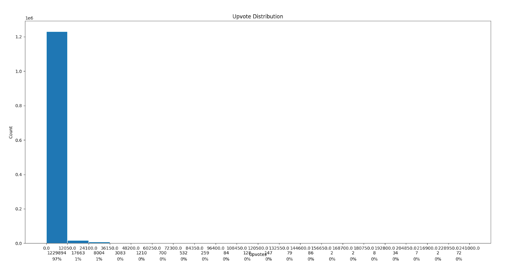
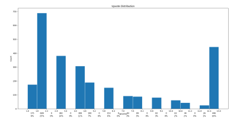
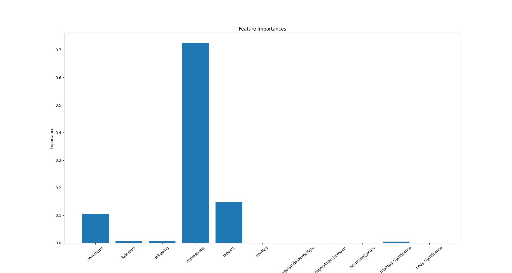
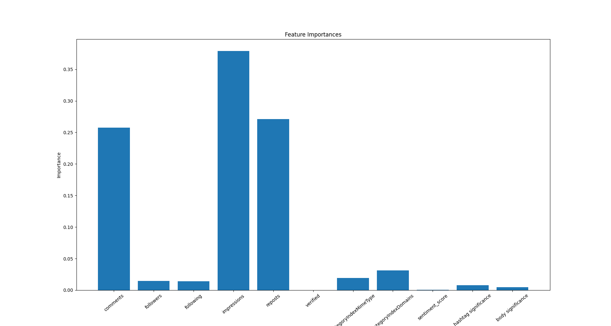
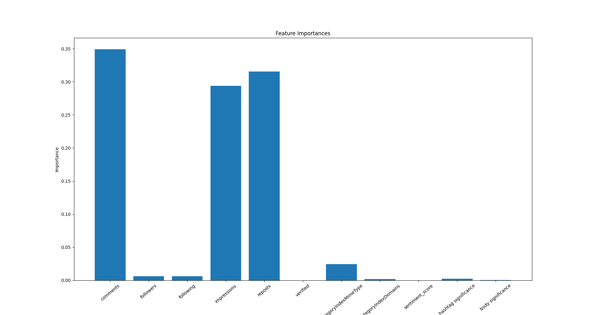
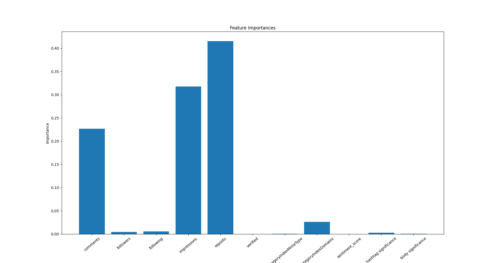
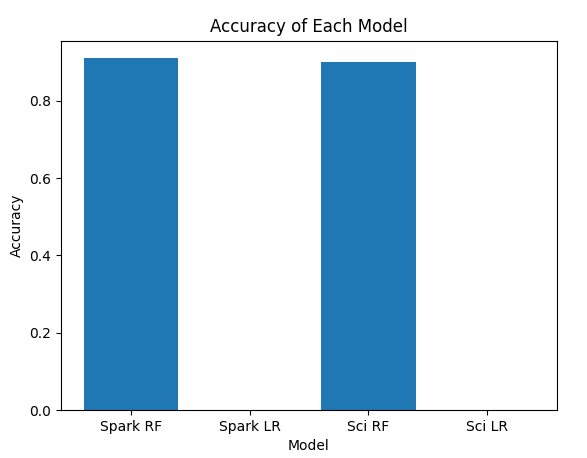
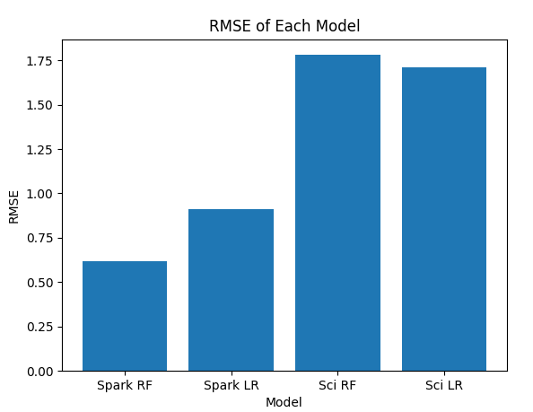
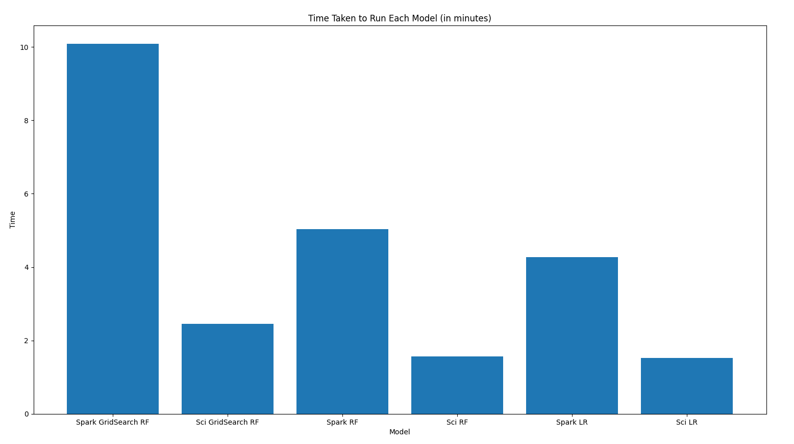

## Team
Jonathan Andrei  
Andrew Ha  
Inés Gonzalez Pepe  

# Abstract

The aim of our project is to be able to predict the number of up-votes a user has on a post, based on the Parler messaging app. We consider the up-votes to be a representative of the user's engagement with others. We aim to determine which factors, such as keywords, type of user, etc. contribute to how popular a post will get. To this end, we intend to utilize a linear regression model, as well as a decision tree model to distinguish between the quality of their predictions and the internal data processing and manipulation by each model.

# Introduction

After the Capital riots on January 6th in the US, analyses were published online discussing links to rioters, based on leaked messages, hashtags and locations. This, in association with the discovery of an article detailing the creation of several different types of popularity predicting models trained on Reddit posts, led to the objective of creating a model that would accurately predict the number of upvotes (aka the popularity) on a Parler post. The dataset that will be used is composed of leaked messages and associated metadata from the alt-tech (uncensored applications and services developed by companies which tend to be favored by right-wing individuals) messaging app Parler and contains identifiers such as username, time of day, key words, etc.

In line with the dataset analysis course project requirements of integrating two different techniques learned in class, we intend to create a linear regression model and a random forest regression model to compare the performance of the models by examining the quality of predictions as well as the internal data processing and data manipulation by each model.

Our hypothesis is that the random forest model will have better performance than the linear regression model. We also believe that the most salient identifiers will be a combination of comments and key words used within the body of the post, as these features represent the celebrity of a user on Parler, hot topics that get people engaged and engagement itself. Moreover, the random forest model is useful in identifying the important features as it shifts the weights associated with each feature in order to determine the optimal ‘importance’ of each feature. It will be interesting to see the results in the training set with the adjustment of importance in features.

# Materials and Methods

The dataset of Parler users has been obtained from the free open source website Zenodo. The dataset contains posts and comments made by Parler users over the period of several months leading to the riots. This dataset is in .ndjson format, so we need to perform some preprocessing to convert our data into .csv format. In addition, we will be using Apache Spark, Pandas and matplotlib to filter, clean and visualize our data and scikit-learn to build our ML model, do metrics analysis and potentially automated hyperparameter tuning. Lastly, with random forest, certain features will be preselected for the models to base their initial training on. Most of these features will require no processing (i.e. username of the poster, reposts, etc.), but the body of the post will need to be processed as we want to make it easy for the model to learn what the message says. To this end, we will use the TF-IDF to obtain word significance and also assign a sentiment analysis score on our post body.

### Upvote Distribution Before and After

  
  

In order to achieve our objective, we need a dataset that has a high percentage of popular posts, but also has a decent range of posts with various ranges of popularity. To this end, we want our data distribution to resemble a bell curve and will be using the goodness of fit algorithm to select the best subsample possible from the raw Parler data. Further preprocessing is still tentative, but involves removal of partially empty or erroneous rows (some comment tallies amount to -1, which bears no meaning to us). For simplicity, only comments in English will be classified within our dataset initially. We may revisit them later on within our project to see if we can take our model further and use those foreign comments in an interesting way. Finally, another factor in our model’s performance that we intend to analyze is the effect of word frequency vs word embedding in regards to the processing of the Parler post’s content.

In brief, we intend to determine first and foremost, the better model between linear regression and random forest and second of all, we want to determine which features are most salient and how best to process our textual data.

#### Magic Processing

  

# Results

Since the dataset was obtained from a Parler leak, the data was completely raw and required significant processing. The first step involved dropping rows and features that were not relevant to our objective and might create noise. The data was then undersampled as it contained too many upvotes that ranged from 0-1000 compared to the rest (1000:1). As a further step, bins for the upvotes (0-1000,1000-2000, etc.) were created to ease labelling when training random forest models. Final processing involved converting significant features into more machine-readable format by utilizing TF-IDF to create a numeric representation of the post’s textual significance or by encoding categorical values into ordinal ones. A sentiment score determining the negativity/positivity of the Parler post was also added as a feature using a sentiment analysis library (TextBlob) in an attempt to improve performance.

It is important to note that we originally set out to examine feature importance between RF and LR models, but this goal became absorbed into our first hypothesis and our ‘new’ second hypothesis became the implementation and comparison of Pyspark MLLib vs scikit-learn models. After building the ML models, optimizing them using GridSearchCV and RandomSearchCV and comparing the RF models to the LR models, we were able to determine that our first hypothesis was partially correct. In fact, the random forest models performed better in terms of accuracy, however, the second part of this hypothesis was incorrect as final results demonstrated that the comment count and body of the post were not as important as we thought they would be. After final adjustments to the data preprocessing in our models, it resulted that the most features across the board were impressions (views on a post) and reposts though comments were ranked 3rd most important feature in the Spark implemented RF models.

In implementing Pyspark ML models, we found that the runtimes were significantly longer than their scikit-learn counterparts, which is surprising considering that Spark is very adept at rapidly handling large datasets. However, the performance metrics of the model indicated that the Pyspark models tended to have higher accuracy and lower error rates then the scikit ones possibly due to processing data that had been entirely processed in Spark and was therefore native, whereas the scikit models dealt with Pandas dataframes obtained from converted Spark dataframes.

### Best Features

#### Scikit-Learn

  
  

#### Spark

  
  

### Accuracy and RMSE

  
  

### Time Taken by Each Model

  

# Discussion

On the surface level, using the ML capabilities of Spark has opened our eyes to the expanding integration of Spark in ML applications that go beyond data processing. That being said, the most eye-opening takeaway of our project was the fact that some of the most important features in all of our models were impressions and reposts. This is remarkable as they had been initially overlooked in favour of implementing more complicated features such as a vectorized body of the post which ultimately did not pan out. Therefore, one possible approach to improving our models could be identifying relevant features that are already present instead of manufacturing and manipulating less salient ones.

This being said, the body of the post does have potential to be a salient feature, so another approach to improving the models’ performance could be into improving the vectorization of the text. Due to its low importance rating, it’s worth considering that the TF-IDF vectorization wasn’t the best approach and to consider other venues such as word2vec or HashingTF. Either way the processing of text can be improved simply by removing stop words (common English words) from the text and hence removing noise.
Further work on the models would probably include more tests and hypertuning being run and while the hypertuning is relatively well-automated due to the GridSearch functions, we noticed that running our models locally took its toll on our computers. Refactoring the code to ensure it is completely parallelized and well-partitioned would definitely be a priority if pursuing this project further.
